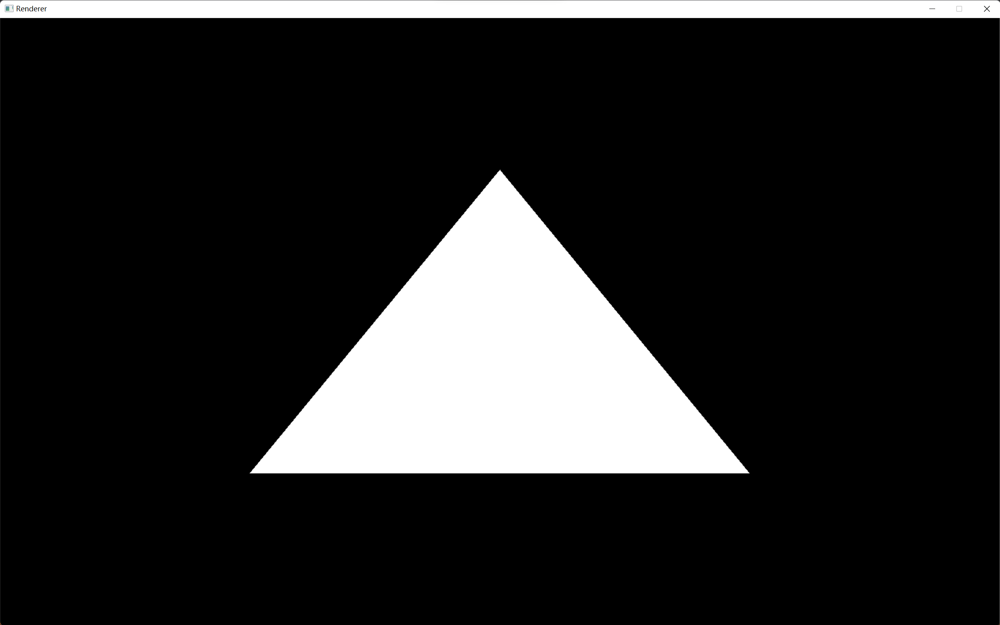
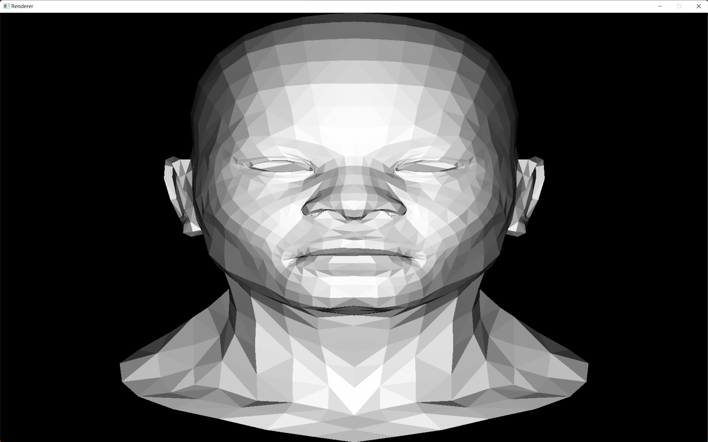
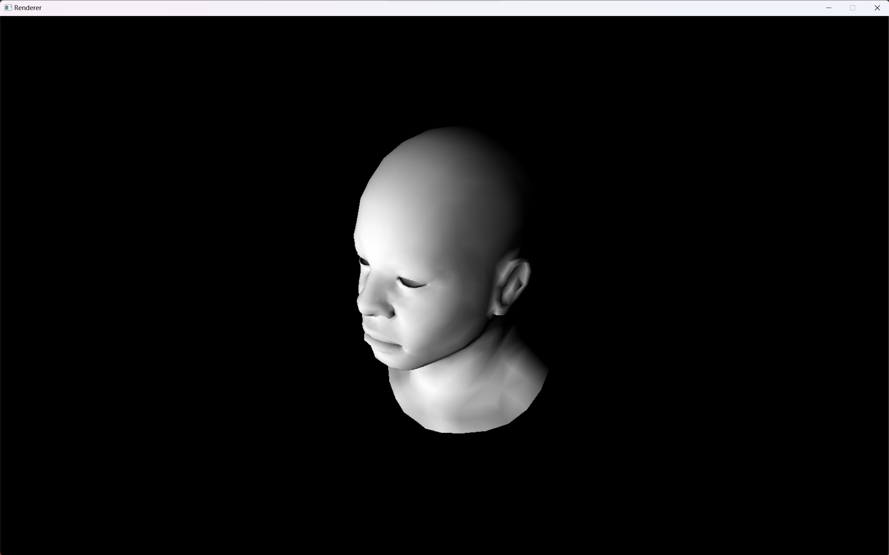
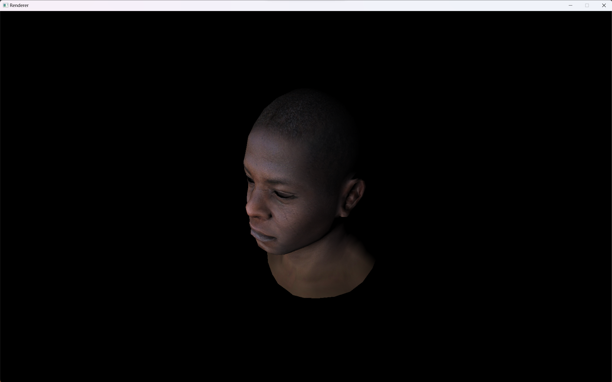

## About The Project
A soft renderer written in c++.

## Renderer Samples
#### Triangle
  
#### Model
  
#### Camera
  
#### Gourad Shading
  
#### Texture
  

## Reference
https://github.com/ssloy/tinyrenderer

## License
This project is licensed under 

## Contact
* Email:[eric199002@icloud.com](eric199002@icloud.com)
* Twitter:[https://twitter.com/nikoniko600](https://twitter.com/nikoniko600)
* Repo:[https://github.com/Eric-Schecter/img2ppt](https://github.com/Eric-Schecter/img2ppt)